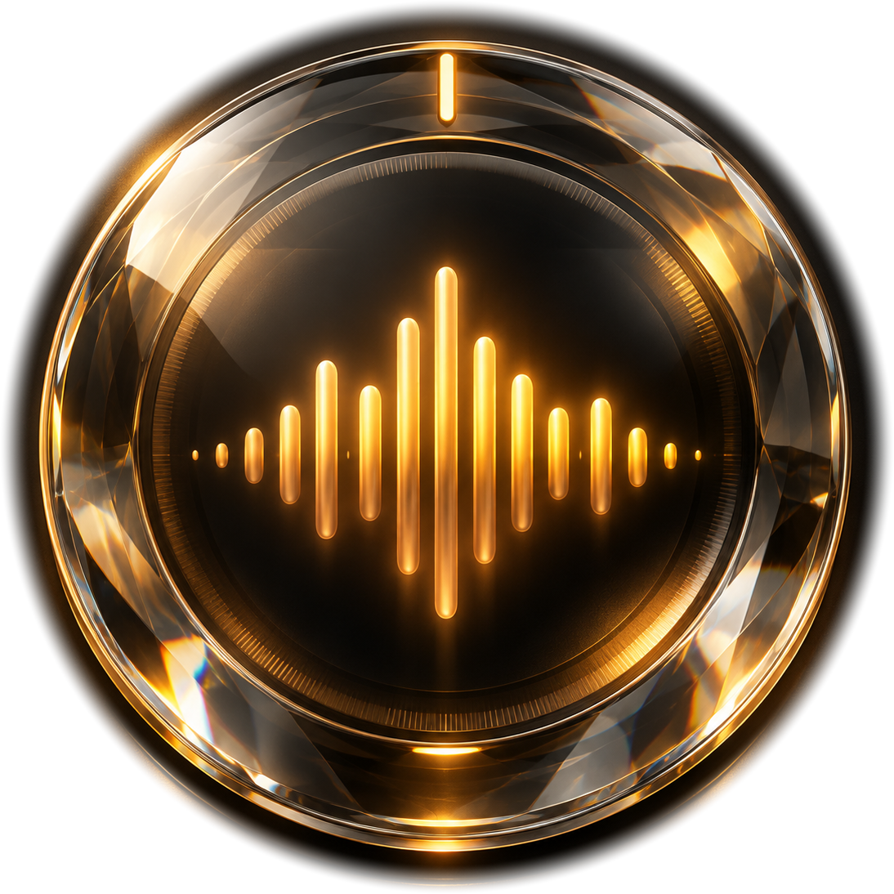
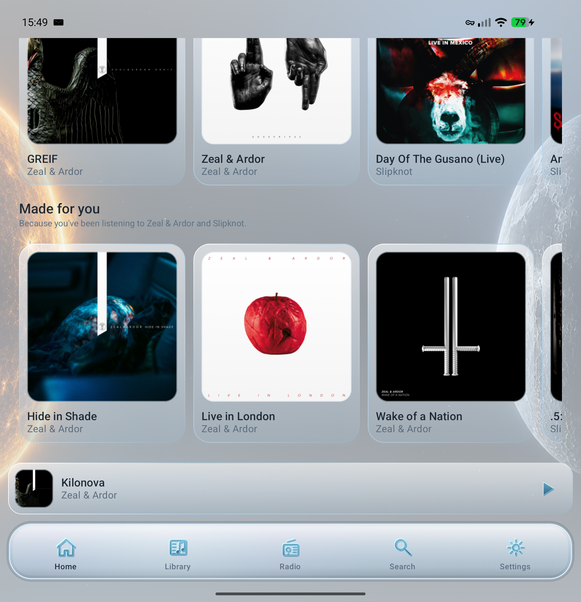
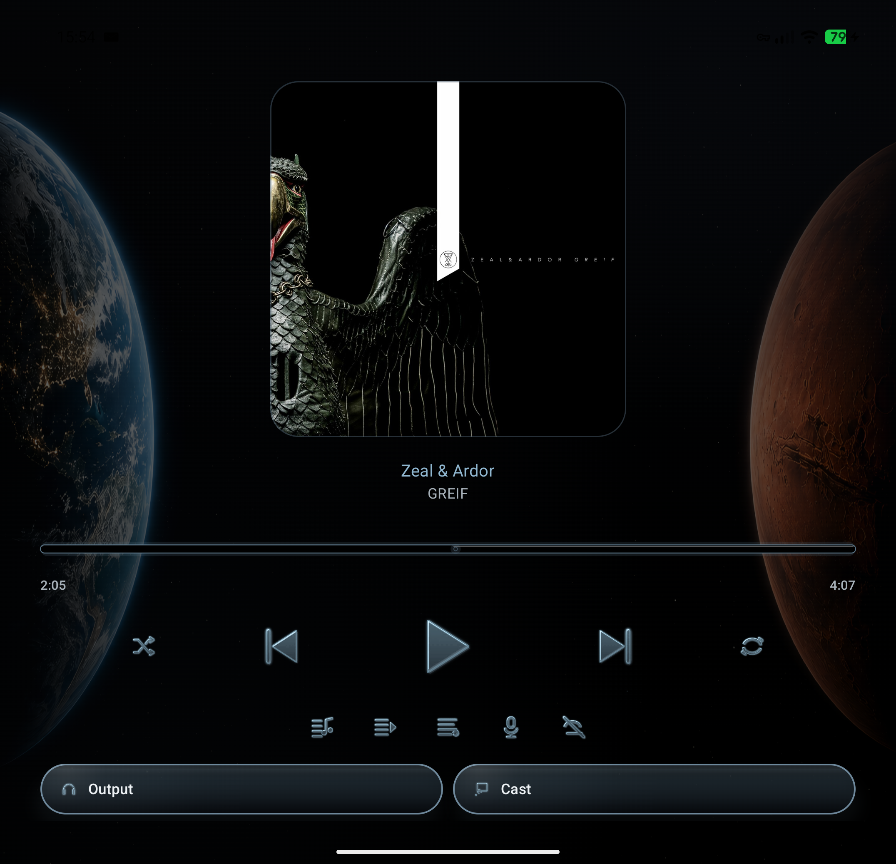
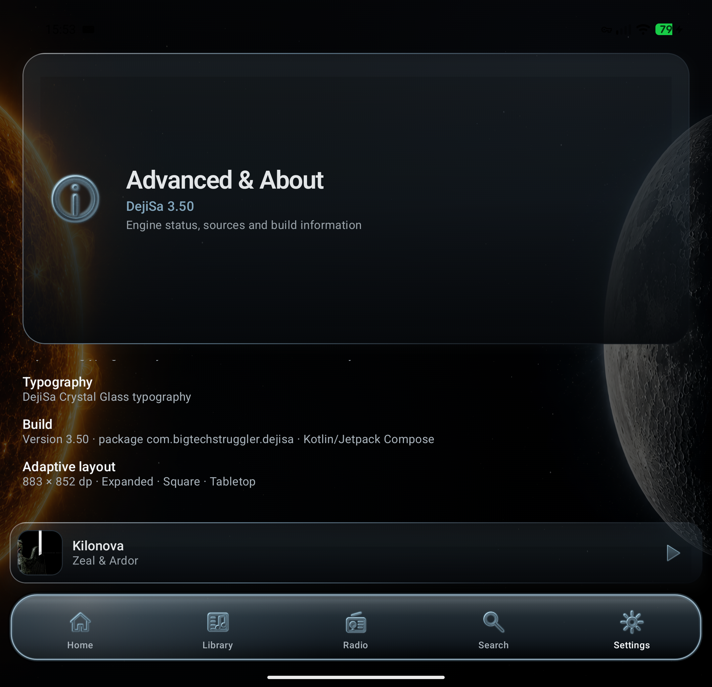

  

# DejiSa 🎵

**A privacy-focused Android music player. Your music. Your sources. Your sound.**

DejiSa is a feature-rich Android music player that brings local music, media servers and network sources together in one unified library.

Play music from local folders, Plex, Emby, Jellyfin, Navidrome/OpenSubsonic, SMB, FTP and SFTP. Use internet radio, UPnP/DLNA output, offline downloads, intelligent caching, playlists, lyrics, music videos, Android home-screen widgets and the **DejiSa Surreality** audio engine from one application.

Connect DejiSa to Vigilsoni for music recognition, recognition history, artist following, release alerts and concert notifications through ntfy and UnifiedPush.

DejiSa also includes its own Crystal Glass interface, adaptive layouts for phones, foldables and tablets, sensor-driven motion, local and WebDAV backups, Playback Intelligence and extensive audio customization.

**One music player. Multiple sources. Your choice.**

---

## 📱 Screenshots

  
  

  

*Moonstone and Melanite Crystal Glass themes shown. Screenshots may show an earlier DejiSa build; the current interface can differ.*

---

## 📥 Download

### Latest release: DejiSa 5.3.7

**[⬇ Download the latest APK](https://github.com/bigtechstruggler/DejiSa-Downloads/releases/latest)**

Download the APK from the release assets and install it on your Android device.

### Requirements

- Android 11 or newer
- Compatible Android device
- Network connectivity for online features

**No Plex, Emby, Jellyfin, Navidrome/OpenSubsonic or other media server is required to play your local music.**

---

## 🎵 One unified music library

Your music should not be limited to a single server, folder or ecosystem.

DejiSa brings music from multiple sources together in one library:

- Local music folders
- Plex Media Server
- Emby Server
- Jellyfin Server
- Navidrome
- OpenSubsonic / Subsonic servers
- SMB 2/3 network shares
- FTP servers
- SFTP servers

Browse your music through unified artist, album, track and playlist views, regardless of where your collection is stored.

Additional library features include:

- Source-specific music indexing
- Cached music catalogues
- Unified artist, album and track views
- Track metadata and artwork
- Unified playback queues
- Locally managed playlists
- Source-aware playback
- Multi-source availability information
- MusicBrainz-aware identity matching where metadata is available

Your music collection remains organized even when different sources are involved.

---

## 🧠 Library Intelligence

DejiSa can combine matching music from different sources without destroying the original source information.

Library Intelligence includes:

- Non-destructive deduplication
- Artist, album and track matching
- MusicBrainz-aware identity matching where available
- Conservative normalized matching where identifiers are missing
- Preservation of separate source variants
- Automatic best-source selection
- Same-track source fallback
- Persistent source aliases
- Playlist continuity when source identities change
- Favorites, history, lyrics and offline data linked to logical library items
- Improved distinction between track artist and album artist
- Conservative metadata merging for artwork, genres, year and titles

DejiSa keeps the logical library clean while preserving the individual source copies behind it.

---

## 🌐 Network music & media servers

DejiSa supports several ways to access music stored on your home network, NAS or remote server.

### SMB 2/3

Connect to compatible SMB network shares and browse music stored on your NAS, computer or home server.

### FTP

Connect to FTP servers and access your remote music collection.

**Security note:** Standard FTP does not encrypt its network traffic. Use it only on networks you trust.

### SFTP

Connect to compatible SFTP servers for music access over an encrypted SSH connection.

### Plex

Connect to your Plex Media Server and bring your Plex music collection into DejiSa.

### Emby

Connect to your Emby Server and bring your Emby music collection into DejiSa.

### Jellyfin

Connect to your own Jellyfin server to synchronize and stream your music library.

Supported Jellyfin features include:

- Music library synchronization
- Artist, album and track browsing
- Playlist access
- Offline downloads
- Configurable synchronization
- Quick Connect support
- Background synchronization
- Cache and library management

### Navidrome / OpenSubsonic

Connect to compatible Navidrome, OpenSubsonic and Subsonic-style servers.

Supported integration includes:

- Multiple servers and accounts
- Artists
- Albums
- Tracks
- Playlists
- Artwork
- Search
- Streaming
- Playlist membership
- Integration with DejiSa's normal library and playback queue

Local and network-based sources are brought together inside DejiSa instead of requiring a different player for each source.

**Media-server integration is optional.** DejiSa can operate using local music and other configured sources only.

---

## 📺 UPnP/DLNA playback

Enjoy your music beyond your phone.

DejiSa supports UPnP/DLNA output for compatible playback devices on your local network.

Features include:

- Discovery of compatible network playback devices
- Selection of available UPnP/DLNA renderers
- Playback through compatible network audio equipment
- Local-network permission handling on supported Android versions

Use your phone to choose the music and a compatible network device to play it.

UPnP/DLNA is an **audio-output feature**, not an additional music-library source.

Availability depends on your network configuration and the capabilities of your receiving device.

---

## ✨ Crystal Glass interface

DejiSa uses a custom-designed Crystal Glass interface with three visual themes.

### 🌕 Moonstone Crystal Glass

A light daytime appearance.

### 💜 Amethyst Crystal Glass

An atmospheric evening appearance.

### 🌑 Melanite Crystal Glass

A deep-night appearance with true AMOLED black.

Themes can switch automatically based on the local time or be selected manually.

### Crystal motion & interaction

The current Crystal interface includes:

- Custom 3D glyph controls
- Adaptive Crystal Dock
- Sensor-driven parallax
- Specular lighting and micro-reflections
- Floating Crystal panes with depth and tilt
- Soft clipping for scrolling Crystal surfaces
- Adaptive dock positioning
- Configurable dock tower animations
- Multiple tower styles
- Slow / Normal / Fast animation speeds
- Reduce Motion support
- Foldable-aware motion behavior
- Individual dock and tower-glyph parallax

### Adaptive layouts

DejiSa adapts to:

- Phones
- Foldables
- Tablets
- Portrait
- Landscape
- Compact and tall layouts

The interface adapts to the device while retaining DejiSa's Crystal Glass design language.

---

## 🎛️ DejiSa Surreality audio engine

DejiSa includes its own audio-processing engine: **DejiSa Surreality**.

Surreality is built around a high-precision audio pipeline with **64-bit DSP calculations** and adaptive output handling for Android devices, headphones, speakers and external DACs.

Audio features include:

- 64-bit digital signal processing
- Adaptive Hi-Res PCM output
- 32-bit float output on supported Android audio routes
- Automatic safe output fallback when a requested format is unavailable
- Surreality DSP and Surreality Pure playback modes
- 10-band graphic equalizer
- Parametric EQ
- Automatic DSP headroom management
- ReplayGain support
- Adaptive normalization
- Peak protection and limiting
- Spatial audio processing
- Personal audio calibration
- Per-device audio profiles
- Device-specific sound optimization
- Multichannel downmix support
- Direct DAC audio functionality
- USB audio device detection and diagnostics
- Configurable playback cache
- Live audio route and format inspection

### Surreality DSP

**Surreality DSP** processes decoded PCM audio using 64-bit calculations before sending it to the Android audio output.

Depending on the active audio route, Surreality can automatically select an appropriate output format. For example, a 16-bit / 44.1 kHz FLAC source can remain at its native sample rate while the DSP pipeline outputs 32-bit float PCM when supported.

The additional output precision does not recreate information that is absent from the original recording. Instead, it provides additional numerical headroom for DSP processing, mixing, equalization and volume calculations before final playback.

### Surreality Pure

**Surreality Pure** bypasses the Surreality DSP processing stages for users who want an unprocessed playback path.

Android, Media3, Bluetooth hardware or connected DACs may still perform their own conversion, mixing or resampling, so Pure mode by itself does not imply bit-perfect playback.

### Adaptive output

Surreality can inspect and adapt to the available Android audio route instead of blindly forcing an unsupported format.

Supported routes may use formats such as:

- 16-bit PCM
- 24-bit PCM
- 32-bit PCM
- 32-bit float PCM

When a selected format is unavailable, Surreality safely falls back to a compatible output instead of breaking playback.

**Note:** Available audio-processing features, output precision, Direct DAC functionality and supported audio routes depend on the Android device, operating system, connected hardware and audio driver capabilities.

---

## 🎚️ Hi-Res, USB & DSD

DejiSa includes additional handling for compatible Hi-Res, USB and DSD playback paths.

Supported functionality includes:

- DSF support
- DFF support
- DSD64 detection
- DSD128 detection
- DSD256 detection
- Native DSD where the Android audio path and connected hardware confirm support
- DoP 1.1
- DSD-to-PCM fallback when native DSD or DoP is unavailable
- Requested, negotiated and actual output diagnostics
- Hardware timestamp information
- Hardware-clock and drift diagnostics
- Buffer and underrun diagnostics

DejiSa does **not** claim to provide its own low-level USB audio driver. Actual playback capabilities depend on Android, the active audio route and the connected DAC.

---

## 🎶 Playback Intelligence

DejiSa extends normal Android Media3 playback with additional transition, recovery and resume logic.

Playback Intelligence includes:

- Smart transition mode
- Gapless transition mode
- Fade transition mode
- Album-aware transition handling
- Disc and track-number awareness
- Shuffle-aware next-track selection
- Configurable next-track prewarming for remote sources
- Persistent long-track resume
- Automatic cleanup of near-end resume positions
- Sleep timer
- End-of-current-track sleep mode
- Source fallback before unavailable tracks are skipped
- Persistent playback and queue restoration
- Playback Intelligence diagnostics in Advanced & About

### Sleep timer

Available timer options include:

- 15 minutes
- 30 minutes
- 45 minutes
- 60 minutes
- End of current track

The queue is preserved when the timer pauses playback.

### Transition note

Fade mode uses fade-out / fade-in behavior. DejiSa does not claim a fake overlapping dual-player crossfade when two tracks are not actually being mixed simultaneously.

---

## 🎬 Music Videos

DejiSa includes a dedicated Music Videos experience without turning the app into a general movie or TV client.

Features include:

- Dedicated Music Videos library section
- Responsive 16:9 artwork grid
- Local music-video discovery in configured music folders
- Jellyfin Music Videos
- Plex Music Videos
- Emby Music Videos
- Dedicated Music Video Now Playing screen
- Portrait and landscape layouts
- Shared Surreality playback controls
- Interactive seeking
- Previous / Next where applicable
- Audio-to-video switching while preserving playback position
- Video-to-audio switching while preserving playback position
- Music Video mini-player
- Offline-only handling for remote videos

Generic movie and TV libraries are intentionally outside DejiSa's focus.

---

## 📻 Internet radio

Discover and organize radio stations from around the world.

Features include:

- Browse stations by continent and country
- Customize available countries
- Save favorite stations
- Access favorites directly from Home
- Dedicated Radio Now Playing interface
- Crystal playback controls
- Vigilsoni recognition access from Radio Now Playing

Explore international radio without leaving your music player.

---

## 📱 Home-screen widgets

DejiSa includes five resizable Android home-screen widgets.

1. Compact Player + Recognize
2. Compact Player
3. Large Player
4. Seek Player
5. Recognize-only

Widgets support:

- Adaptive layouts
- Horizontal and vertical resizing
- Optional transparent backgrounds
- Playback controls where applicable
- Music recognition shortcuts
- Localized widget labels
- Crystal-style touch feedback

Control your music or start recognition directly from your Android home screen.

---

## 🔎 Vigilsoni Companion

DejiSa can connect to a compatible Vigilsoni service for music discovery and notification features.

Supported integration includes:

- Music recognition
- Recognition history
- Short audio-sample recognition
- Artist following
- New release notifications
- Concert notifications
- Upcoming-concert previews
- Dedicated upcoming-concert screen
- Artist-library export
- Pairing status
- UnifiedPush status

Connection is established through QR-code pairing.

When you start music recognition, DejiSa records a short audio sample and sends it to the configured Vigilsoni service through an authenticated ntfy relay.

Vigilsoni processes the recognition request and sends the result back to DejiSa through UnifiedPush.

### Recognition feedback

While Vigilsoni is actively recording, Music Now Playing and Radio Now Playing can show DejiSa's **Signature Crystal ring** around the recognition microphone. The active treatment disappears when the recording phase ends.

### Artist export

DejiSa can export its deduplicated logical artist library to a compatible Vigilsoni service.

Export data can include:

- Artist name
- MusicBrainz Artist ID where available
- Favorite status
- Contributing source labels

**Vigilsoni requires a compatible service and configuration.**

---

## 🔔 Notifications with ntfy & UnifiedPush

DejiSa integrates with **[ntfy](https://ntfy.sh/)** and **[UnifiedPush](https://unifiedpush.org/)** for notifications and communication with Vigilsoni.

Supported functionality includes:

- New music release notifications
- Concert notifications
- Music recognition results
- Artist-following responses
- Recognition-related events
- Companion data-change events

### How it works

**Outgoing requests**

DejiSa sends supported requests, including short music-recognition audio samples, to Vigilsoni through an authenticated ntfy relay.

**Incoming notifications**

Vigilsoni delivers supported events and recognition results back to DejiSa through UnifiedPush.

**Your choice of distributor**

Use ntfy as your UnifiedPush distributor or choose another compatible distributor.

You can also use your own compatible ntfy server.

This architecture avoids requiring Google Firebase Cloud Messaging for DejiSa's Vigilsoni notifications and gives users more control over notification delivery.

---

## 💾 Offline music & intelligent cache

Take your music with you.

DejiSa uses a source-neutral offline and cache system rather than limiting offline playback to one server type.

Pinned offline downloads can work with supported sources such as:

- Jellyfin
- Plex
- Emby
- Navidrome
- OpenSubsonic
- SMB
- SFTP
- FTP

Offline and cache features include:

- Resumable `.part` downloads
- Retry and backoff
- Persistent pending-download queue
- Clean source replacement when a partial download can no longer continue safely
- Wi-Fi / Ethernet-only option
- Original/direct quality preference where available
- Offline albums
- Offline playlists
- Separate pinned downloads and automatic cache
- Automatic LRU cache
- Protection of pinned music during cache cleanup
- Network-to-offline playback fallback where possible
- Offline artwork
- Offline metadata
- Offline lyrics
- Per-source storage accounting
- Application-wide Offline Mode

DejiSa playlists can contain tracks from different music sources and are not tied to a single Plex, Emby or Jellyfin account.

---

## ▶️ Now Playing

DejiSa's Now Playing experience is shared across music, radio and music videos where the controls are appropriate.

Features include:

- Signature Crystal play/pause control
- Circular volume control
- Live RMS/equalizer visualization
- Interactive seeking
- Live scrub updates
- Improved touch targets
- Shuffle and repeat controls
- Repeat One
- Lyrics access
- Offline controls
- Favorite controls
- Persistent active Crystal feedback
- Momentary touch feedback
- Adaptive layouts
- Foldable support
- Crystal motion
- Pull-down gesture to minimize or dismiss Now Playing
- Configurable dismiss animations
- Reduce Motion support

Radio keeps radio-specific behavior, such as avoiding meaningless seek controls for true live streams.

---

## 🌍 Onboarding & language packs

DejiSa includes a Crystal-styled setup experience designed for new installations and reconfiguration.

The onboarding flow supports configured sources such as:

- Local music
- Jellyfin
- Plex
- Emby
- Navidrome / OpenSubsonic
- Network sources

Features include:

- Multi-step setup flow
- Crystal-themed transitions
- Animated control demonstrations
- Responsive layouts
- Reduce Motion support
- JSON language-pack import
- Local language-pack storage
- English fallback
- Placeholder validation
- Plural validation
- Translation coverage checks
- RTL-aware Compose layout support

Language packs can extend the interface without replacing the built-in English fallback.

---

## ⚡ Reliability & performance

DejiSa 5.x includes extensive runtime and reliability work in addition to visible features.

Examples include:

- MediaController reconnect and rebuild logic
- Bounded reconnect backoff
- Better recovery after service interruption and fold/unfold
- Playback source fallback inside the playback service
- Improved queue and playback-state restore
- Reduced duplicate playback-state publication
- Reduced unnecessary Compose redraws
- Reduced unnecessary notification refreshes
- More efficient Jellyfin sync updates
- Demand-driven playback-position polling
- More efficient audio-meter data handling
- Reduced redundant high-refresh-rate visualizer work
- Bounded artwork loading and decoding
- Reduced artwork-memory cache pressure
- Temporary-file streaming for large remote artwork paths
- Smaller widget artwork decode targets
- Improved protection against artwork-related memory pressure

The goal is not only to add features, but to keep DejiSa responsive during large-library browsing, artwork loading, playback and background operation.

---

## 🔄 Backup and restore

Back up your application settings and music configuration.

Supported options include:

- Local `.dejisa` backup files
- WebDAV backup storage
- Optional inclusion of credentials
- Optional password-protected encryption
- Playlist restoration
- Settings restoration

Choose local storage or a configured WebDAV destination.

**Keep your backups and recovery passwords somewhere safe.**

---

## 🔐 Privacy and security

DejiSa is designed with privacy in mind.

The application is developed without:

- Advertising SDKs
- Analytics SDKs
- Behavioral telemetry

Additional privacy features include:

- Android Keystore-backed credential protection where applicable
- Optional encrypted backups
- Local-first playlist storage
- Local profiles with optional biometric authentication
- Configurable music and network sources
- Optional self-hosted services
- UnifiedPush-based Vigilsoni notifications

Network access is used only where required for configured functionality, such as:

- Plex
- Emby
- Jellyfin
- Navidrome / OpenSubsonic
- Internet radio
- Remote music sources
- Artwork and metadata retrieval
- Vigilsoni
- ntfy and UnifiedPush

Local music playback does not require a media-server account.

---

## 📦 Installation

1. Open the latest release.
2. Expand **Assets**.
3. Download the DejiSa APK.
4. Open the APK on your Android device.
5. Allow installation from the selected source if Android requests permission.
6. Install and launch DejiSa.

For updates, download the latest signed APK and install it over your existing installation.

---

## 🔄 Updates and releases

All official DejiSa APK releases are published through GitHub Releases.

**[⬇ Download the latest release](https://github.com/bigtechstruggler/DejiSa-Downloads/releases/latest)**

**[📦 View all releases](https://github.com/bigtechstruggler/DejiSa-Downloads/releases)**

This repository provides public application information and documentation.

APK distribution takes place through the linked release repository.

The full Android application source is maintained separately and is not included in the public distribution repository.

Automatically generated GitHub source archives contain the files present in the corresponding public release repository, not the separately maintained private application source.

---

## ❤️ A very special thank-you

A huge thank-you to **[Philipp C. Heckel](https://github.com/binwiederhier)**, the creator of ntfy, everyone who contributes to the project, and the people behind UnifiedPush.

You've made something genuinely useful, beautifully simple, and wonderfully independent.

**After the wheel and fire, ntfy might just be humanity's next great invention.** 🔥🛞🔔

Seriously, thank you for making this possible.

---

## 🇯🇵 About the name

DejiSa is derived from the Japanese expression for digital sound:

**デジタルサウンド — *Dejitaru Saundo***

Deji + Sa.

---

## ❤️ Support this project

If you enjoy this project and want to support my work:

[☕ Support me on Ko-fi](https://ko-fi.com/bigtechstruggler)

Your support helps me keep building and maintaining my projects — and gets me one tiny step closer to that Jaguar XJ8 (X350). 🐆

Support is completely optional. The software remains free.

---

# DejiSa — Your music. Your sources. Your sound. 🎵
