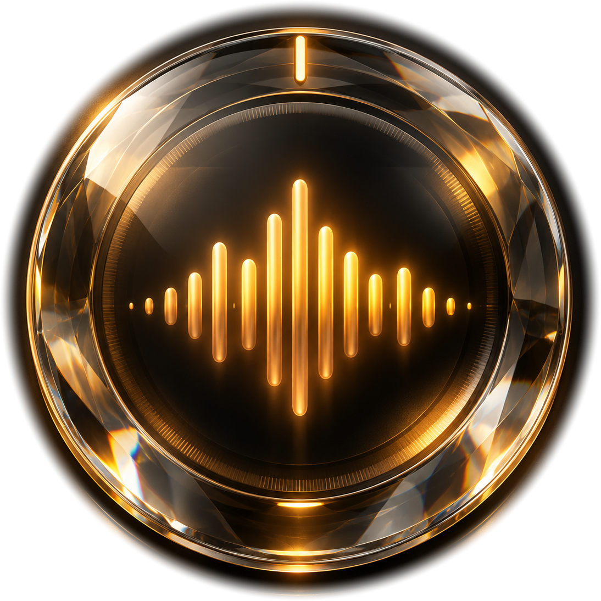

  

# DejiSa 🎵

**A privacy-focused Android music player. Your music. Your sources. Your sound.**

DejiSa is a feature-rich Android music player that brings your music together in one unified library.

Enjoy Jellyfin integration, local music, SMB, FTP and SFTP network sources, personalized internet radio, UPnP/DLNA playback, offline downloads, playlists, lyrics, customizable home-screen widgets and Sonic Core DSP.

Connect to Vigilsoni for music recognition, recognition history, artist following, release alerts and concert notifications through ntfy and UnifiedPush.

DejiSa also features customizable Crystal Glass themes, adaptive layouts, local and WebDAV backups, and extensive playback customization.

**One music player. Multiple sources. Your choice.**

---

## 📥 Download

### Latest release: DejiSa 3.50

**[⬇ Download the latest APK](https://github.com/bigtechstruggler/DejiSa-Downloads/releases/latest)**

Download the APK from the release assets and install it on your Android device.

### Requirements

- Android 11 or newer
- Compatible Android device
- Network connectivity for online features

**No Jellyfin server or online account is required to play your local music.**

---

## 🎵 One unified music library

Your music should not be limited to a single server, folder or ecosystem.

DejiSa brings music from multiple sources together in one library:

- Local music folders
- Jellyfin music servers
- SMB 2/3 network shares
- FTP servers
- SFTP servers

Browse your music through unified artist, album, track and playlist views, regardless of where your collection is stored.

Additional library features include:

- Source-specific music indexing
- Cached music catalogues
- Artist and album browsing
- Track metadata and artwork
- Unified playback queues
- Locally managed playlists

Your music collection remains organized even when different sources are involved.

---

## 🌐 Network music

DejiSa supports several ways to access music stored on your home network, NAS or remote server.

### SMB 2/3

Connect to compatible SMB network shares and browse music stored on your NAS, computer or home server.

### FTP

Connect to FTP servers and access your remote music collection.

**Security note:** Standard FTP does not encrypt its network traffic. Use it only on networks you trust.

### SFTP

Connect to compatible SFTP servers for music access over an encrypted SSH connection.

### Jellyfin

Connect to your own Jellyfin server to synchronize and stream your music library.

Local and network-based sources are brought together inside DejiSa instead of requiring a separate music player for each source.

---

## 📺 UPnP/DLNA playback

Enjoy your music beyond your phone.

DejiSa supports UPnP/DLNA output for compatible playback devices on your local network.

Features include:

- Discovery of compatible network playback devices
- Selection of available UPnP/DLNA renderers
- Playback through compatible network audio equipment
- Local-network permission handling on supported Android versions

Use your phone to choose the music and a compatible network device to play it.

UPnP/DLNA is an **audio-output feature**, not an additional music-library source.

Availability depends on your network configuration and the capabilities of your receiving device.

---

## ✨ Crystal Glass interface

DejiSa features a custom-designed interface with three visual themes.

### 🌕 Moonstone Crystal Glass

A light daytime appearance.

### 💜 Amethyst Crystal Glass

An atmospheric evening appearance.

### 🌑 Melanite Crystal Glass

A deep-night appearance with true AMOLED black.

Themes can switch automatically based on the local time or be selected manually.

### Additional interface features

- Custom 3D glyph controls
- Adaptive Crystal Dock
- Sensor-driven specular lighting
- Wallpaper and slideshow backgrounds
- Customizable dock positioning
- Adaptive layouts for phones, foldables and tablets
- Support for different screen sizes and orientations

The interface adapts to your device while retaining DejiSa's distinctive Crystal Glass design.

---

## 🎧 Sonic Core audio engine

DejiSa includes its own Sonic Core audio-processing system.

Audio features include:

- Digital signal processing
- Audio output profiles
- Equalizer functionality
- Audio calibration tools
- Device sound optimization
- Direct DAC audio functionality
- Configurable playback cache

Customize your listening experience for your device and connected audio equipment.

**Note:** Available audio-processing features, output modes and DAC functionality depend on your Android device, connected hardware and supported audio routes.

---

## 📡 Jellyfin integration

Connect DejiSa to your self-hosted Jellyfin server.

Supported features include:

- Music library synchronization
- Artist, album and track browsing
- Playlist access
- Offline album downloads
- Configurable synchronization
- Quick Connect support
- Background synchronization
- Cache and library management

Your Jellyfin collection becomes part of DejiSa's unified music library.

**Jellyfin is optional.** DejiSa can also operate using local music and other configured sources.

---

## 📻 Internet radio

Discover and organize radio stations from around the world.

Features include:

- Browse stations by continent and country
- Customize available countries
- Save your favorite stations
- Access favorites directly from Home
- Dedicated radio playback interface

Explore international radio without leaving your music player.

---

## 📱 Home-screen widgets

DejiSa includes five resizable Android home-screen widgets.

1. Compact Player + Recognize
2. Compact Player
3. Large Player
4. Seek Player
5. Recognize-only

Widgets support:

- Adaptive layouts
- Horizontal and vertical resizing
- Optional transparent backgrounds
- Playback controls where applicable
- Music recognition shortcuts

Control your music or start recognition directly from your Android home screen.

---

## 🔎 Music recognition with Vigilsoni

DejiSa can connect to a compatible Vigilsoni service for additional music discovery functionality.

Supported integration includes:

- Music recognition
- Recognition history
- Short audio-sample recognition
- Artist following
- New release notifications
- Concert notifications

Connection is established through QR-code pairing.

When you start music recognition, DejiSa records a short audio sample and sends it to the configured Vigilsoni service through an authenticated ntfy relay.

Vigilsoni processes the recognition request and sends the result back to DejiSa through UnifiedPush.

Recognition history and artist-following features are also integrated into the application.

**Vigilsoni requires a compatible service and configuration.**

---

## 🔔 Notifications with ntfy & UnifiedPush

DejiSa integrates with **[ntfy](https://ntfy.sh/)** and **[UnifiedPush](https://unifiedpush.org/)** for notifications and communication with Vigilsoni.

Supported functionality includes:

- New music release notifications
- Concert notifications
- Music recognition results
- Artist-following responses
- Recognition-related events

### How it works

**Outgoing requests**

DejiSa sends supported requests, including short music-recognition audio samples, to Vigilsoni through an authenticated ntfy relay.

**Incoming notifications**

Vigilsoni delivers supported events and recognition results back to DejiSa through UnifiedPush.

**Your choice of distributor**

Use ntfy as your UnifiedPush distributor or choose another compatible distributor.

You can also use your own compatible ntfy server.

This architecture avoids requiring Google Firebase Cloud Messaging for DejiSa's Vigilsoni notifications and gives users more control over notification delivery.

---

## 💾 Offline music and playlists

Take your music with you.

DejiSa supports offline listening through downloaded music and local files.

Features include:

- Offline album downloads
- Offline music browsing
- Locally managed playlists
- Playlists containing tracks from different music sources
- Playback cache with configurable storage limits
- Application-wide Offline Mode

DejiSa playlists are independent of Jellyfin accounts.

An application-wide Offline Mode keeps local and downloaded music available while pausing remote services.

Your downloaded music remains accessible when your music server or internet connection is unavailable.

---

## 🎶 Playback features

DejiSa provides a full music playback experience through Android's Media3 playback framework.

Features include:

- Background audio playback
- Playback queues
- Shuffle and repeat
- Interactive seeking
- Lyrics
- Album artwork
- Playlist management
- Audio-output selection
- Configurable playback caching
- Headset and media-control integration

Browse your collection, manage your queue and control playback from within DejiSa or supported Android media controls.

---

## 🔄 Backup and restore

Back up your application settings and music configuration.

Supported options include:

- Local `.dejisa` backup files
- WebDAV backup storage
- Optional inclusion of credentials
- Optional password-protected encryption
- Playlist restoration
- Settings restoration

Choose local storage or a configured WebDAV destination.

**Keep your backups and recovery passwords somewhere safe.**

---

## 🔐 Privacy and security

DejiSa is designed with privacy in mind.

The application is developed without:

- Advertising SDKs
- Analytics SDKs
- Behavioral telemetry

Additional privacy features include:

- Android Keystore-backed credential protection where applicable
- Optional encrypted backups
- Local-first playlist storage
- Local profiles with optional biometric authentication
- Configurable music and network sources
- Optional self-hosted services
- UnifiedPush-based Vigilsoni notifications

Network access is used only where required for configured functionality, such as:

- Jellyfin
- Internet radio
- Remote music sources
- Artwork and metadata retrieval
- Vigilsoni
- ntfy and UnifiedPush

Local music playback does not require a Jellyfin account.

---

## 📦 Installation

1. Open the latest release.
2. Expand **Assets**.
3. Download the DejiSa APK.
4. Open the APK on your Android device.
5. Allow installation from the selected source if Android requests permission.
6. Install and launch DejiSa.

For updates, download the latest signed APK and install it over your existing installation.

---

## 🔄 Updates and releases

All official DejiSa APK releases are published through GitHub Releases.

**[⬇ Download the latest release](https://github.com/bigtechstruggler/DejiSa-Downloads/releases/latest)**

**[📦 View all releases](https://github.com/bigtechstruggler/DejiSa-Downloads/releases)**

This repository provides public application information and documentation.

APK distribution takes place through the linked release repository.

The full Android application source is maintained separately and is not included in the public distribution repository.

Automatically generated GitHub source archives contain the files present in the corresponding public release repository, not the separately maintained private application source.

---

## ❤️ A very special thank-you

A huge thank-you to **[Philipp C. Heckel](https://github.com/binwiederhier)**, the creator of ntfy, everyone who contributes to the project, and the people behind UnifiedPush.

You've made something genuinely useful, beautifully simple, and wonderfully independent.

**After the wheel and fire, ntfy might just be humanity's next great invention.** 🔥🛞🔔

Seriously, thank you for making this possible.

---

## 🇯🇵 About the name

DejiSa is derived from the Japanese expression for digital sound:

**デジタルサウンド — *Dejitaru Saundo***

Deji + Sa.

---
## ❤️ Support this project

If you enjoy this project and want to support my work:

[☕ Support me on Ko-fi](https://ko-fi.com/bigtechstruggler)

Your support helps me keep building and maintaining my projects — and gets me one tiny step closer to that Jaguar XJ8 (X350). 🐆

Support is completely optional. The software remains free.
# DejiSa — Your music. Your sources. Your sound. 🎵
